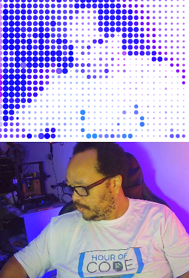

# P5JS

Aqui ficarão as anotações, códigos e links/vídeos referentes ao estudo de p5JS.

Começei a estudar p5.js usando o livro "[Getting Started with p5.js](https://www.amazon.com.br/dp/B016VF1G3W/ref=dp-kindle-redirect?_encoding=UTF8&btkr=1)" de Lauren McCarthy, Casey Reas & Ben Fry

Na pasta [gsp5js](./gsp5js) estão os códigos que fiz no processo de aprendizagem.

Vídeos:
* A
* B

## Testes com a Webcam

Depois de estudar/brincar com p5js uma das primeiras coisas que fiz foi uma interação com a WebCam, onde baseados na imagem que a camera estava captando (imagem de baixo) gerava uma segunda imagem usando bolinhas que representavam as cores da webcam (imagem de cima)

O Código se encontra na pasta [testes/webcam01](testes/webcam01)